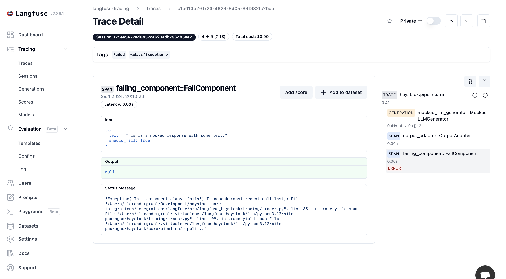

# langfuse-haystack

[](https://pypi.org/project/langfuse-haystack)
[](https://pypi.org/project/langfuse-haystack)

-----

**Table of Contents**

- [Installation](#installation)
- [License](#license)

## Installation

```console
pip install langfuse-haystack
```

## About
This is a community built integration for the Langfuse Open Source LLM Engineering Platform. It uses the Haystack tracing functionality as described in https://docs.haystack.deepset.ai/docs/tracing. This extension provides detailed tracking of pipeline executions and component runs. Designed specifically for monitoring LLM applications, it allows for efficient diagnostics and performance assessment.

Example of a nested pipeline trace:


It also enables tracing errors within components: 




## Usage
To gain comprehensive insights, ensure content tracing is enabled:

```python
langfuse = Langfuse(
  secret_key="<secret key>",
  public_key="<public key>",
  host="https://cloud.langfuse.com"
)

haystack_tracer = LangfuseTracer(langfuse)
tracing.enable_tracing(haystack_tracer)
tracing.tracer.is_content_tracing_enabled = True
```

See the complete example in [trace_with_langfuse.py](./examples/trace_with_langfuse.py).

## License

`langfuse-haystack` is distributed under the terms of the [Apache-2.0](https://spdx.org/licenses/Apache-2.0.html) license.
